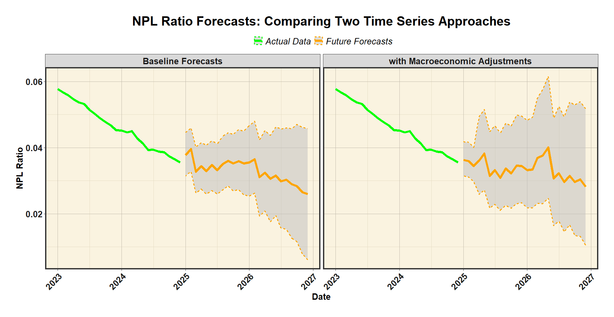

# Adjusting Prophet Model Forecasts with Macroeconomic Indicators: A SARIMAX & MLR Approach

*A Forecast Adjustment Framework Incorporating Macroeconomic Trends.*

___

### OVERVIEW

Accurate Non-Performing Loan (NPL) Ratio forecasts are crucial for financial institutions to assess credit risk and ensure financial stability. The NPL Ratio represents the percentage of loans that may not be repaid, making reliable forecasting essential for proactive risk management.

Prophet models can predict future NPL trends by detecting non-linear patterns and seasonality with minimal adjustments. Additionally, macroeconomic indicators can be incorporated as external regressors to refine future forecasts. However, naively including these regressors presents challenges:

*	**Selecting the right economic indicators** – With many macroeconomic factors to choose from and limited data availability, a limited set of macroeconomic combination is recommended. However, Prophet does not automatically determine the most relevant predictors, often requiring subjective selection.

*	**Avoiding redundant or correlated variables** – Without careful selection, multiple economic indicators may introduce high correlation between each other or multicollinearity, risking model reliability and interpretability.

To address these issues, this project employs Multiple Linear Regression (MLR) with Best Subset Selection to systematically identify the most relevant set of macroeconomic factors before incorporating them into a SARIMAX model. This approach enhances Prophet forecasts by integrating key economic indicators, resulting in more interpretable projections and deeper economic insights.


### INSTALLATION

##### *Prerequisites*

To run this projecet, ensure you have the following installed before proceeding with this project:

* R
* RStudio
* Git

##### *Required Packages*

Install the necessary packages for the project using the line of R script below:

```r
install.packages(c(
  "openxlsx", "dplyr", "imputeTS", "astsa", "tseries", "zoo",
  "leaps", "forecast", "lmtest", "purrr", "stringr",
  "lubridate", "prophet", "ggplot2"
))
```

##### *Running the Project*

1. Clone or download this repository
2. Run the scripts in the following order:
* `01 Data Processing Variables.R`
* `02 ARIMA Model - Data Processing.R`
* `03 SARIMAX + PROPHET Model Validation - MODEL 9254.R`

##### *NOTE:*
- The R script file, `01.5 Multiple Linear Regression - Checking.R`, is unnecessary to run the whole project. It serves as proof of experimentation for the data transformations and stationarity.
- This project does not include an `.Rproj` file. You can run the R scripts manually or create one by opening the folder in RStudio and selecting `New Project > Existing Directory`.

### DATA COLLECTION

For detailed variable descriptions, please see this project's [Data Dictionary](Data%20Dictionary%20-%20SARIMAX%20Adjustment%20Model.pdf).

### MODEL SELECTION AND TRAINING

1.	Due to the limited size of the monthly dataset and the large number of potential macroeconomic indicators, a limit is imposed on the number of regressors or exogenous variables. To ensure non-arbitrary selection of these indicators, we use a Multiple Linear Regression (MLR) framework in combination with the Best Subset Selection approach.
2.	Best Subset Selection evaluates all possible combinations of regressors, within the imposed limit, and selects the optimal model based on statistical criteria and other considerations.
3.	After performing Best Subset Selection, the following criteria were applied to determine the final list of candidate models:
  * **Multicollinearity** – Models with regressors exhibiting high multicollinearity (VIF > 5) or excessive correlation between macroeconomic indicators were avoided to ensure stable estimates.
  * **Homoscedasticity** – Models with non-constant variance in error terms were excluded, verified through the Breusch-Pagan test (p-value > 0.05)
  * **Cointegration Test** – Models with non-stationary error terms, indicating unstable long-term relationships between regressors and the target variable (NPL ratios), were rejected, verified through the Engle-Granger test (p-value > 0.05)
  * **Non-Duplication** – Models containing redundant regressors (e.g., the original regressor and its lag variant) were excluded to avoid information duplication
4.	Regression models that handle time series information also must account for autocorrelation or serial correlations within the regressors and target variable, depicting correlation with their past values. To account for these autocorrelations, migrating the chosen model to SARIMAX is necessary
5.	Time series regression models must account for autocorrelation or serial correlation, where regressors and the target variable correlate with past values. To address these autocorrelations, the selected model is transitioned to SARIMAX, which explicitly handles these dependencies.

### FORECASTING AND POST-PROCESSING

1.	This project will forecast NPL ratios and the other macroeconomic indicators for the next 24 months after December 2024, giving the monthly predictions for 2025 and 2026.
2.	As endorsed in the project title, the future forecasts of the historical NPL ratios are done using Prophet with an additional cosine Fourier term to help improve the baseline forecasts.
3.	On the other hand, the future forecasts of macroeconomic indicators from the chosen model use ETS models on their original scaling before consolidating their future forecasts with the historical data and applying the same data transformation done in the MLR-Best Subset Selection framework. 
4.	The SARIMAX outputs of the chosen model will be reverted back to its original scaling with the help of Prophet’s baseline forecasts of future NPL ratios, using them to revert the differencing and log transformations done prior the model selection.

### RESULTS AND INSIGHTS

##### *Selected Macroeconomic Adjustment Model*

After testing combinations of macroeconomic indicators from the candidate models produced by the MLR and Best Subset Selection approach, and evaluating statistical criteria and intuitiveness, the final list of models is retrieved. There are other models to choose from, but in this case, I have selected the model with the following macroeconomic indicators:

* Consumer Price Index - All Items
* CCI / Consumer Confidence Index
* GDP / Gross Domestic Product (2-months lag)
* Gross Capital Information (5-months lag)

.png)

These macroeconomic indicators cover consumer prices, sentiment, economic activity, and investments—capturing how shifts in the broader economy can influence NPL ratios, both in the short and longer term..

##### *NPL Ratio Forecast Results: SARIMAX (Final Adjusted Output)*

Using the macroeconomic indicators from the chosen MLR model, the SARIMAX model was developed. Since the model was trained on transformed data, the separate baseline Prophet forecasts were used to revert the result to its original scale. This is to improve the interpretability of the SARIMAX forecasts.

.png)

Based on the reverted results, the NPL ratios for 2025 and 2026 are expected to remain at historically low levels, continuing the trend in the post-COVID era. However, small upward movements are projected in the early half of both years, suggesting a potential target for caution from short-term economic fluctuations.

##### *Forecast Comparison: SARIMAX-Adjusted VS Prophet Baseline*

In the graph below, you can see how the SARIMAX model aligns well with the historical trend. Compared to the baseline Prophet forecasts, the SARIMAX adjustments bring a slight upward shift to the forecast. In addition, the SARIMAX-adjusted predictions follow a similar structure to both the baseline Prophet forecasts and some of the recent historical data - indicating a good fit with past trends while incorporating macroeconomic context.

-VS-Actual-(Prophet)-Plot.png)

##### *Future Forecast Uncertainty (Confidence Intervals)*

The confidence intervals display the range of uncertainty in the predictions. Following the SARIMAX adjustments, the forecast confidence intervals had widened slightly, which is to be expected, as incorporating macroeconomic indicators introduces additional variability, suggesting a more cautious risk outlook.



##### *Model Performance - Train vs Test Set*

Based on the model performance across the training and testing sets, the SARIMAX adjustment displayed strong results in both MAE and RMSE, performing even better on the test set than on the training set. Although there was a slight increase in MAPE, the test set performance remains within an acceptable threshold (approximately 5%).

|             | ME       | RMSE   | MAE    | MPE   | MAPE | ACF1 |
|:-----------:|:--------:|:------:|:------:|:-----:|:----:|:----:|
|Train Data   |-0.00026  |0.00322 |0.00186 |-0.29% |2.81% |-0.05 |
|Test Data    |-0.00037  |0.00262 |0.00178 |-1.44% |5.15% |0.296 |

One minor concernis the ACF1 value, which suggests mild autocorrelation in the residuals.
This may be attributed to how the differenced outputs of the SARIMAX model are reverted back to the original scaling using the Prophet forecasts, introducing some level of dependency on the Prophet model.

### CLOSING NOTES

This project combines traditional statistical modeling in SARIMAX and Multiple Linear Regression with the modern forecasting of Prophet to explore how macroeconomic factors can be incorporated systematically to the baseline NPL ratio predictions.

If you have any thoughts on this, feek free to reach out or [connect with me on Linkedin](https://www.linkedin.com/in/john-adrian-adona/)!
